# 🚘 Autonomous Vehicle Navigation System (Perception) Using Object Detection
This repository contains the implementation of the project titled _"Autonomous Vehicle Navigation System (Perception) Using Object Detection_, at the Department of Mechatronics Engineering (DOME), Federal University of Technology Minna (FUTMinna), Nigeria.

---

## 🧭 Overview
In autonomous driving, perception plays an important role in enabling vehicles to understand and interact safely with their surroundings. It involves sensing the environment and constructing an accurate representation so as to enable it properly navigate its environmet. 
For an autonomous vehicle to operate intelligently and safely, its perception system must effectively detect and recognize objects along its path. This project focused on developing an object detection algorithm capable of accurately identifying road anomalies and lane features along the vehicle’s path to enhance navigation and decision-making.

---

## 🔍 Project Objectives
- To develop an algorithm capable of detecting road anomalies specifically speed bumps, potholes and cracks along the autonomous vehicle's path.
- To accurately identify road boundaries (with and without lanes).

---

## 🤖 Tools and Technologies

| Tool/Library                              | Purpose in the Project                                                                                                                                                                                |
| ----------------------------------------- | ----------------------------------------------------------------------------------------------------------------------------------------------------------------------------------------------------- |
| **Python**                                | Served as the core programming language for implementing the computer vision algorithms and integrating both road anomaly and lane detection modules.                                                       |
| **OpenCV (cv2)**                          | Used for reading video streams, image preprocessing, edge detection, region masking, object detection inference (via DNN module), and visualization of detected lanes and bounding boxes. |
| **NumPy**                                 | Enabled handling of numerical computations, arrays, geometric transformations, and mathematical operations required for image processing and line detection.                                |
| **YOLO v4 (You Only Look Once, version 4)**             | The deep learning model architecture used for real-time road anomaly detection, and lane features within the vehicle’s environment.                                             |
| **Darknet Configuration & Weights Files** | Contained the pre-trained YOLO network parameters (`.cfg` and `.weights`) utilized by OpenCV’s DNN module for performing inference.                                                                   |
| **OpenCV DNN Module**                     | Provided a framework for loading and running the YOLO model within OpenCV, handling inference, Non-Maximum Suppression (NMS), and confidence-based filtering.                                         |
| **Canny Edge Detection**                  | Used as a pre-processing step in identifying edges to prepare each image frame before the application of Hough Line Transform |
| **Hough Line Transform**                  | Implemented through OpenCV for detecting straight lines representing road lanes within video frames.                                                                                                  |
| **CSV Library**                           | Used to record and store detected lane coordinates and geometric information for later analysis.                                                                                                  |
| **Math Library (atan2, sqrt, degrees)**   | Used for calculating line angles and distances between points to determine line orientations and remove overlapping detections.                                                                       |
| **Time Library**                          | Measured frame rates (FPS) during object detection to evaluate the system’s real-time performance.                                                                                                    |
---

## 🪜 Step-by-Step-Procedure

The algorithm combined **Computer Vision techniques** specifically **Object Detection** and **Hough Line Transform** to identify **road anomalies** and **lane boundaries** along the vehicle’s path with the use of the **CS-3DW303**, 5- meaga pixel webcamera.  

Pre-trained weights from the **YOLOv4 (You Only Look Once)** model were loaded using the **OpenCV** library. These weights were utilized to detect the targeted road anomalies which were **potholes**, **speed bumps**, and **cracks** in real-time video streams captured by the **web camera** mounted at the center of the vehicle’s bonnet.  

To complement the anomaly detection process, **Hough Line Transform** was also done to detect lane boundaries. The process began with **edge detection** using the **Canny Edge Detector**, which highlighted regions of high intensity changes corresponding to the road’s edges. The resulting edge map was then transformed into **Hough Space**, where lines were interpreted as areas with the highest intensity values. These areas indicated the most prominent lane boundaries within each frame.  

The **road anomaly detection** process by the model followed three main stages:  

- **Feature Extraction:**  
  The YOLOv4 model, built on the **CSPDarknet53** convolutional neural network, extracted key visual features from each input frame. Multiple convolutional layers captured hierarchical patterns such as texture, shape, and color variations, which were used to distinguish anomalies from regular road surfaces.  

- **Feature Classification:**  
  Extracted features were analyzed and classified into different types of road anomalies such as **potholes**, **cracks**, and **speed bumps** based on their unique visual characteristics.  

- **Object Detection:**  
  The model then localized each detected anomaly using **bounding boxes** defined by pixel coordinates. These bounding boxes helped indicate the exact location of road anomalies within each image frame.  

Finally, the [coordinates of detected anomalies](Test_Images/anomalies_data.png) and [lane positions](lanes_data_results.csv) were each logged into two separate **CSV files** respectively. This data was later utilized for **path planning**, **navigation**, and **control decisions** in the autonomous vehicle, enabling it to avoid hazards and maintain a safe trajectory.

---

## 🔹 Results

After developing the algorithm, it was deployed on a Raspberry Pi 4, model B, with 8GB RAM storage which was then mounted on the autonomous vehicle to detect the road anomalies and lane boundaries. The results for the deployment on the vehicle is shown in following sections:

### Results for Detection of Speedbumps

  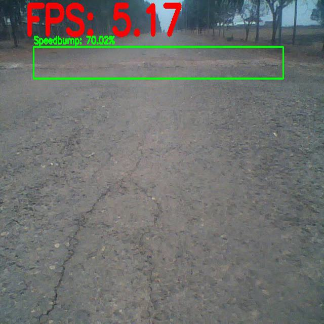
  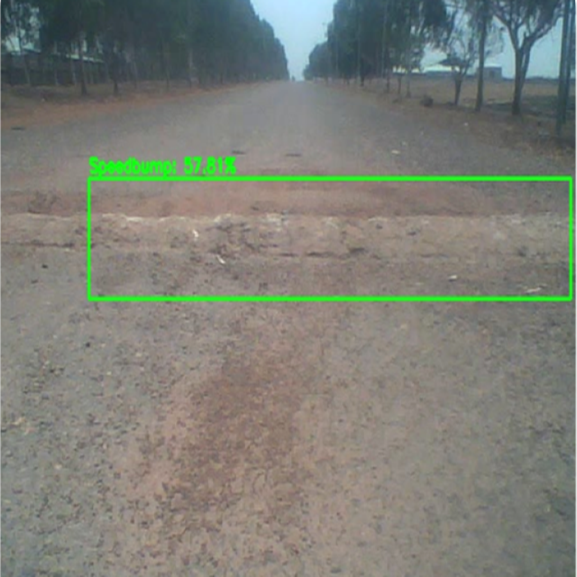
     
    <em> Fig 1: Detection Results for Speedbumps </em>

### Results for Detection of Cracks

  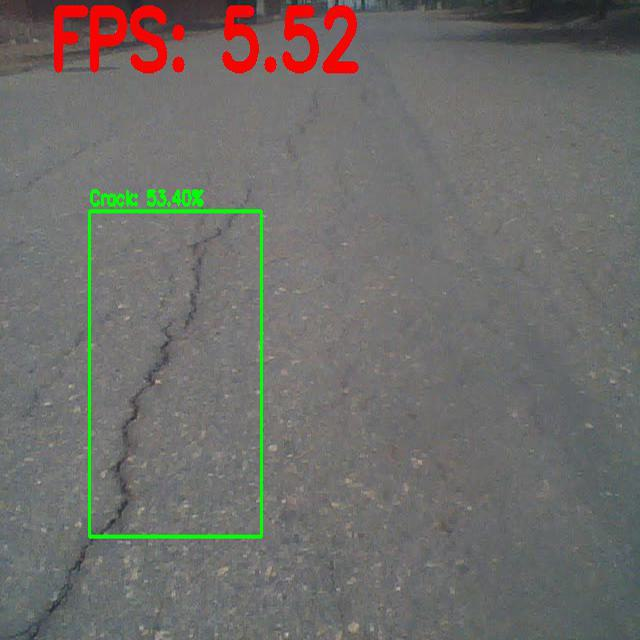
  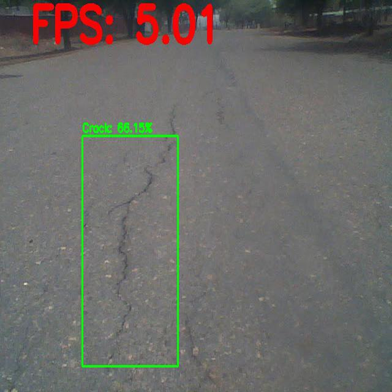
     
    <em> Fig 2: Detection Results for Cracks </em>

### Results for Detection of Potholes

  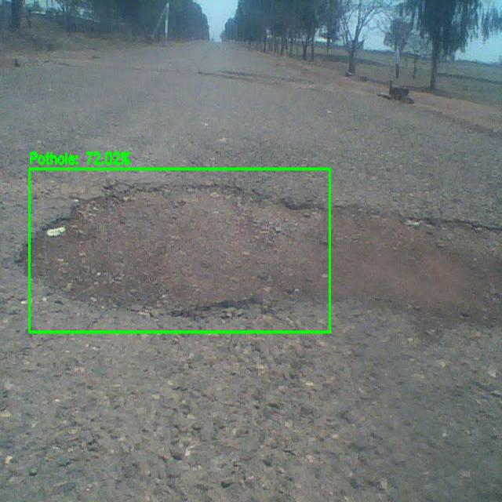
  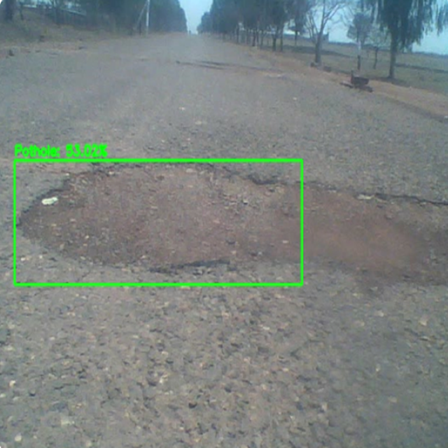
     
    <em> Fig 3: Detection Results for Potholes </em>

### Lane Detection Results

  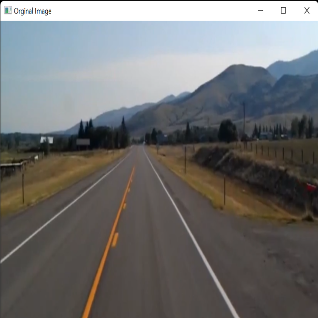
  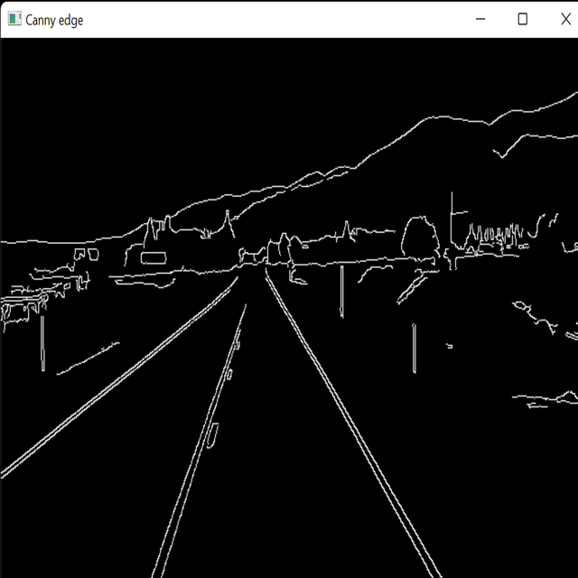
  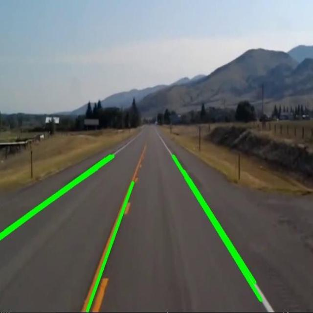
     
    <em> Fig 4: Detection Results for Lanes </em>

### Camera Setup and Vehicle View

  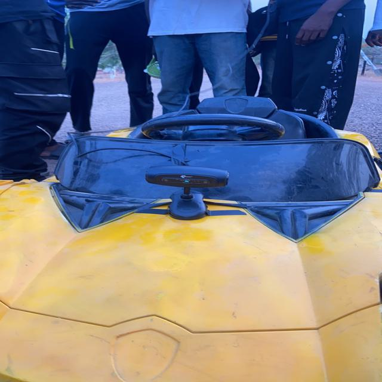
  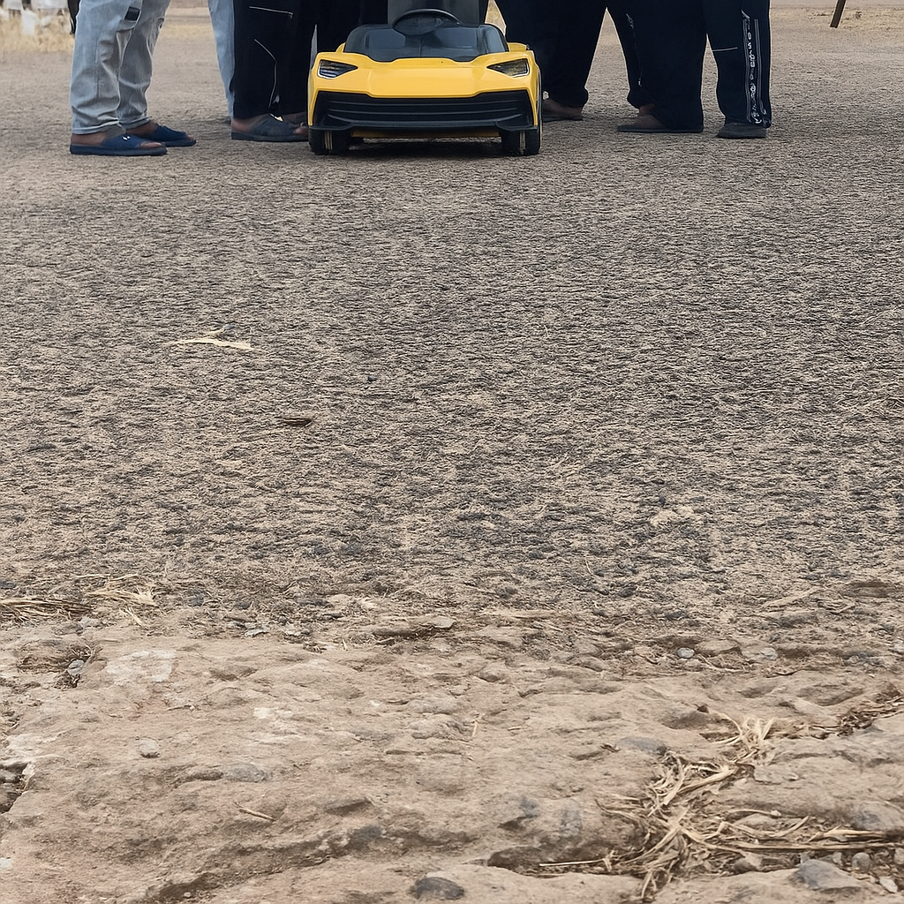
     
    <em> Fig 5: Diagram Depicting the Front View of the Autonomous Vehicle and the Webcamera Mounted on its Bonnet. </em>

---

## ⚠️ Disclaimer
The implementation of this project came with some limitations, which are outlined below along with potential remedies:

- **Model Accuracy Under Adverse Conditions:** Despite the model performing excellently under normal lighting conditions, the detection accuracy of road anomalies (speedbumps, potholes, and cracks) was affected under poor lighting or weather conditions. Improving the model with additional training data that includes diverse environmental conditions and using higher-quality cameras could improve accuracy and relaibility.

- **Camera Stability:** Rough terrain caused instability of the onboard camera, making it challenging to accurately detect road boundaries in real-time. Using a stabilized mounting system or gimbal can help maintain a consistent camera position during movement.

- **Processing Lag:** Detection sometimes lagged due to the limited computational power of the Raspberry Pi 4B used for deployment. Utilizing a more powerful edge device or optimizing the algorithm for lower computational load can reduce latency and improve real-time performance.

---
## 👥 Contributors

- **Engr. Dr Jibril Abdullahi Bala** : Staff Advisor
- **Rizama Victor Samuel**  [GitHub: Rizama-Victor](https://github.com/Rizama-Victor)
- **George Alianengiya**  [GitHub: aiBard101](https://github.com/aiBard101)
- **Oladejo Sodiq Opeyemi**  [GitHub: surdma](https://github.com/surdma)

---

## 📌 Note
Please kindly note that this README file is a summarized version of the full implementation of this project. Dataset and Model Weights can be provided upon request.

